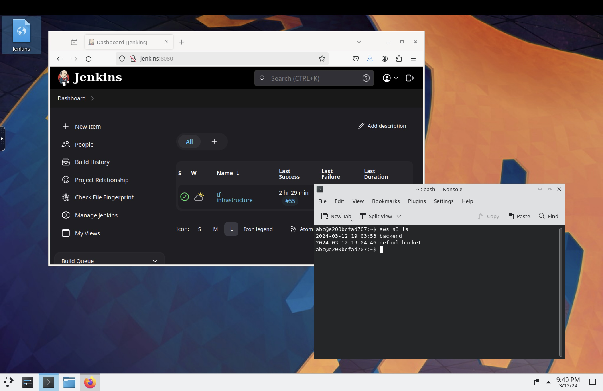

# LocalStack Workbench
AWS Infrastructure Development environment based on LocalStack, Webtop, Jenkins for mocking AWS IaC with terraform

"[LocalStack](https://www.localstack.cloud)" allows the simulation of an AWS Account with a lot of services supported (including setting up K8s workloads in EKS) for local mocking of setup of Infrastructure.

The environment provided in this repo can be used as a basic toolset for developers to easy start over with Terraform IaC development for AWS.

"[Webtop](https://docs.linuxserver.io/images/docker-webtop/)" is used as a Linux Desktop with KDE as Desktop environment with aws, terraform and Visual Studio Code getting preinstalled when setting up the Workbench.

Additionally a Jenkins container is getting started to support setting up IaC code pipelines.

## Prerequisites
- Docker environment / Docker Desktop installed and reachable
- docker cli and docker-compose cli installed
- Localstack license obtained (free of costs license available for private evaluation purposes)

## Setup
- Clone git repo
- in root directory of repo execute:
./setup-environment.sh

After the script finished setting up all components, setup of Jenkins needs to be finished. The needed InitialAdminPassword is provided by the installer script
Further hints on Jenkins you can find below.

## Use
- Open http://localhost:3000 to access LocalStack Webtop:

Available Toolset:
- aws
- terraform
- Visual Studio Code
- pipx is preinstalled in Jenkins to allow, e.g. to install terraform-local or other python based tools

## Jenkins
Jenkins is installed to allow to set up IaC via terraform automatically via pipeline. Terraform (as arm64 binary) is preinstalled in /opt directory. If the binary does not fit the actual architecture, just replace it in the repos ./configs/jenkins directory with the one fitting your needs.

### recommended Plugins and tools:
- Terraform plugin
- AnsiColor plugin
- terraform-local (install via pipeline - see below)

### example Pipeline Script
(replace GitHub URL and credentials with proper data)

    pipeline {
        agent any
        options {
            ansiColor('xterm')
        }
        stages {
            stage('GitHub Checkout') {
                steps {
                    script {
                        checkout scmGit(branches: [[name: '*/main']], extensions: [], userRemoteConfigs: [[credentialsId: 'credentialsid', url: 'git@github.com:username/repo.git']])
                    }
                }
            }
            stage('Install tflocal') {
                steps {
                    script {
                        sh '/usr/bin/pipx install terraform-local'
                    }
                }
            }
            stage('Terraform Init') {
                steps {
                    script {
                        sh 'LOCALSTACK_HOSTNAME=localhost.localstack.cloud /root/.local/bin/tflocal init -reconfigure'
                    }
                }
            }
            stage('Terraform Plan') {
                steps {
                    script {
                        sh 'LOCALSTACK_HOSTNAME=localhost.localstack.cloud /root/.local/bin/tflocal plan -out=tfplan'
                    }
                }
            }
            stage('Terraform Apply') {
                steps {
                    script {
                        sh 'LOCALSTACK_HOSTNAME=localhost.localstack.cloud /root/.local/bin/tflocal apply tfplan'
                    }
                }
            }
        }
    }

### Hints
Basically terraform can be used to set up resources in localstack. But using terraform with S3 configured as backend for tfstate file leads to authorization (443) errors when trying to do terraform init.

Therefore LocalStack tflocal wrapper script (terraform-local) can be used to overcome this restriction (see example pipeline).

# Todo
- preinstall terraform in Jenkins container automatically via Dockerfile